[English](#english) | [中文](#中文)

---

<a id="中文"></a>

# 多站点滨海城市复合热应激概率预测与不确定性量化

## 项目简介

本项目基于 ERA5 单点逐小时再分析数据，构建了一个 **概率时序预测模型**，用于预测未来 24 小时热应激水平，并量化预测中的不确定性。

项目覆盖四个不同气候区的滨海城市：

| 站点 | 气候类型 | 坐标 |
|------|---------|------|
| 青岛 (Qingdao) | 温带季风，夏季湿热 | 36.25°N, 120.50°E |
| 迪拜 (Dubai) | 干旱亚热带，极端干热 | 25.25°N, 55.25°E |
| 新加坡 (Singapore) | 热带，全年高湿 | 1.25°N, 103.75°E |
| 迈阿密 (Miami) | 亚热带，飓风易发海岸 | 25.75°N, -80.25°E |

模型预测两个热应激指标：

1. **Heat Index (HI)**：温度与湿度共同作用下的体感热负荷指标（NOAA 公式）
2. **WBGT-like**：基于湿球温度、辐射和风速构造的近似户外热应激指标

不确定性分解为：

- **Aleatoric uncertainty**：数据本身的随机性与噪声（由模型的异方差输出学习）
- **Epistemic uncertainty**：模型认知不确定性（通过 MC Dropout 估计）

## 研究动机

单纯预测 2 米气温无法充分描述滨海城市"高温高湿"的人体风险。高湿会削弱蒸发散热，海风会改变通风冷却条件，辐射和地表热储存会强化体感热压力。因此，本项目将问题建模为：

**过去 72 小时多变量气象序列 → 未来 24 小时热应激概率分布预测**

## 数据集

数据来源：ERA5 single-level hourly time series（2010-01-01 至 2025-12-31，共 16 年）

```
data/era5_qingdao.csv
data/era5_dubai.csv
data/era5_singapore.csv
data/era5_miami.csv
```

原始变量包括 14 个 ERA5 字段：2m 温度、2m 露点温度、皮肤温度、海表温度、10m/100m 风分量、阵风、海平面气压、地表气压、短波/长波辐射、降水。

## 模型架构

核心模型为 **Probabilistic GRU**（`train.py` 中的 `ProbabilisticGRU` 类），共约 **328,000 个可训练参数**。

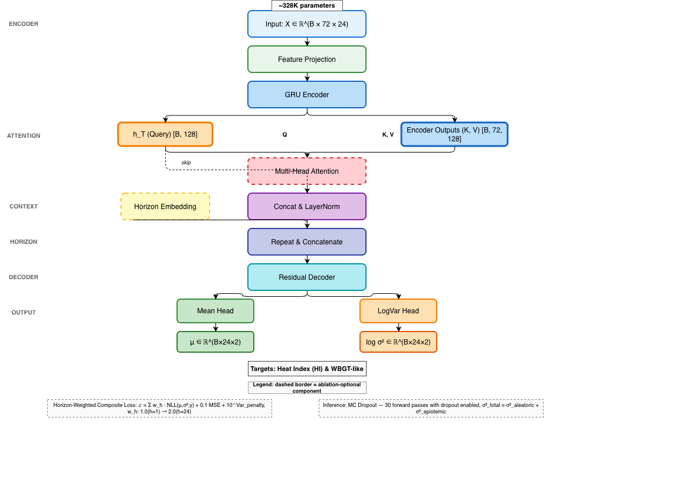

### 关键设计

1. **Feature Projection**：`Linear(24→64) + LayerNorm + GELU + Dropout`，将原始特征映射到紧凑表示
2. **GRU Encoder**：2 层双向 GRU（hidden_size=128），捕捉热量积累、湿度滞后等时间依赖
3. **Multi-Head Attention**（4 头）：学习历史窗口中哪些时刻对预测更重要，替代了简单的单头注意力
4. **Horizon-aware Decoder**：可学习的 horizon embedding 让模型区分近期与远期预测
5. **Residual Decoder**：两个残差 MLP block（带 LayerNorm），改善梯度流和训练稳定性
6. **概率输出头**：每个未来时刻、每个目标输出 `mean` 和 `log-variance`，即 `y_t ~ N(mean_t, var_t)`

### Ablation 变体

通过命令行标志可以禁用各组件进行消融实验：
- `--no-attention`：禁用多头注意力
- `--no-horizon-embed`：禁用 horizon embedding
- `--deterministic`：训练确定性基线（仅 MSE，不输出方差）

## 训练配置

| 参数 | 值 |
|------|------|
| Lookback 窗口 | 72 小时 |
| 预测 Horizon | 24 小时 |
| 优化器 | AdamW (lr=3e-4, weight_decay=1e-5) |
| 调度器 | CosineAnnealingLR (eta_min=1e-6) |
| 最大 Epochs | 60 |
| Early Stopping Patience | 10 |
| Batch Size | 256 |
| Dropout | 0.2 |
| 数据划分 | 70% train / 15% val / 15% test |

### 损失函数

使用 **Horizon-Weighted Composite Loss**：

```
L = weighted_NLL + 0.1 * MSE + 1e-4 * variance_penalty
```

- **NLL 项**按 horizon 加权（1h 权重 1.0 → 24h 权重 2.0），鼓励模型关注更难预测的远期
- **MSE 项**帮助均值收敛更稳定
- **Variance penalty** 防止模型无脑增大方差

## 评估指标

| 指标 | 含义 | 理想方向 |
|------|------|---------|
| RMSE | 均方根误差 | ↓ |
| MAE | 平均绝对误差 | ↓ |
| Gaussian NLL | 概率分布质量 | ↓ |
| Coverage@90% | 90% 预测区间覆盖率 | ≈ 0.90 |
| **CRPS** | 连续排序概率评分（proper scoring rule） | ↓ |
| **Winkler Score** | 预测区间评分（兼顾宽度与覆盖） | ↓ |
| **Skill Score** | 相对于 persistence 基线的技能得分 | ↑ (>0) |
| Avg Aleatoric Std | 数据不确定性 | 视情况 |
| Avg Epistemic Std | 模型认知不确定性 | ↓ |

## 实验结果

### 多站点全模型对比

| 站点 | HI RMSE | HI CRPS | HI Skill | WB RMSE | WB CRPS | WB Skill |
|------|---------|---------|----------|---------|---------|----------|
| Qingdao | 1.831 | 0.960 | 0.625 | 1.415 | 0.732 | 0.562 |
| Dubai | 1.682 | 0.863 | 0.822 | 0.845 | 0.449 | 0.804 |
| Singapore | 1.188 | 0.649 | 0.554 | 0.389 | 0.214 | 0.549 |
| Miami | 1.465 | 0.755 | 0.742 | 1.009 | 0.465 | 0.626 |

### 消融实验（青岛站点）

| 变体 | HI RMSE | HI CRPS | HI Cov@90% | WB RMSE | WB CRPS | WB Cov@90% |
|------|---------|---------|------------|---------|---------|------------|
| **Full model** | **1.831** | **0.960** | 0.905 | **1.415** | **0.732** | 0.906 |
| w/o Attention | 1.798 | 0.937 | 0.905 | 1.409 | 0.722 | 0.899 |
| w/o Horizon Embed | 2.502 (+37%) | 1.390 | 0.904 | 1.781 (+26%) | 0.961 | 0.920 |
| Deterministic | 1.823 | 2.710 | 1.000* | 1.405 | 2.331 | 1.000* |

> *Deterministic 模型的 Coverage=100% 和高 CRPS 是因为它不输出有意义的方差，因此 CRPS 作为概率评分远劣于概率模型。

### 关键发现

1. **Horizon embedding 是最关键的组件**：去掉后 HI RMSE 上升 37%，WB RMSE 上升 26%
2. **多头注意力未带来显著提升**：w/o Attention 变体在所有指标上均略优于 Full Model（HI RMSE 1.798 vs 1.831, CRPS 0.937 vs 0.960），差异约 1-2%，处于随机噪声范围内。这说明对于基于单点时序的热应激预测任务，GRU 最后隐状态已编码了足够的时序信息，额外的注意力聚合未能提供有意义的增益，反而因引入约 33K 额外参数略微增加了过拟合风险。这一发现提示：**模型设计应优先投入在输出端的结构创新（如 horizon embedding）而非编码端的复杂化**
3. **概率模型在 CRPS 上远优于确定性模型**：full model CRPS=0.960 vs deterministic CRPS=2.710
4. **16 年数据显著提升了预测精度**：青岛 HI RMSE 从 2.011 降至 1.831（-9%）
5. **模型在所有站点和 horizon 上均优于 persistence baseline**：Skill Score 0.55—0.82
6. **校准接近理想**：90% coverage 在 0.90—0.92 之间，非常接近名义值

---

## 探索性数据分析 (EDA)

在模型训练之前，我们对四个站点的 ERA5 原始数据进行了系统性的探索性数据分析，以理解数据质量、特征分布和时序特性。运行方式：

```bash
python eda.py                        # 分析所有站点
python eda.py --site qingdao dubai   # 分析指定站点
```

### 数据质量

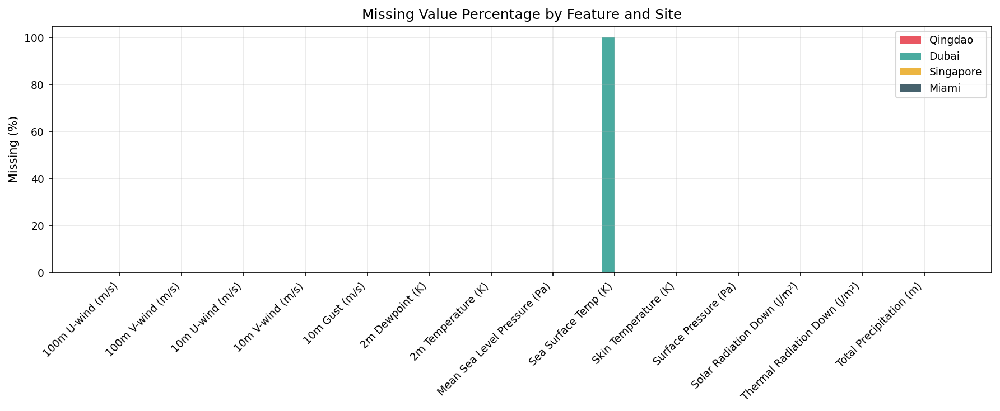

除 **Dubai 的 SST（海表温度）完全缺失**（站点位于陆地格点）外，其余特征和站点均无缺失值。训练脚本中已用皮肤温度（skt）作为 SST 的 fallback 处理。详细统计见 `results/eda_basic_stats.csv`。

### 特征分布

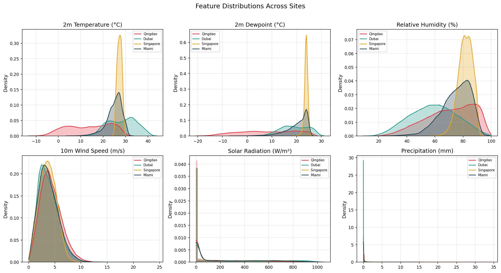

各站点气候差异显著：
- **温度**：新加坡分布极窄（26-31°C），青岛跨度最大（-13~33°C）
- **相对湿度**：新加坡常年 >80%，迪拜较干燥
- **降水**：高度右偏（skewness 8~49），绝大多数时刻为零

### 特征相关性

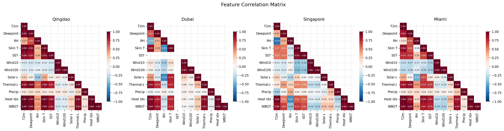

关键发现：
- **t2m 与 Heat Index 相关性极高**（0.98-1.00），温度是主要驱动因子
- **Wind10 与 Wind100 高度相关**（0.89-0.96），存在冗余但模型有足够容量处理
- 新加坡站点特征间相关性整体偏弱（温度变化范围小）

### 目标变量分布

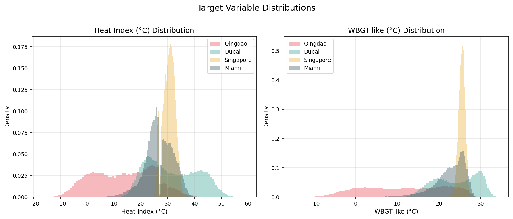

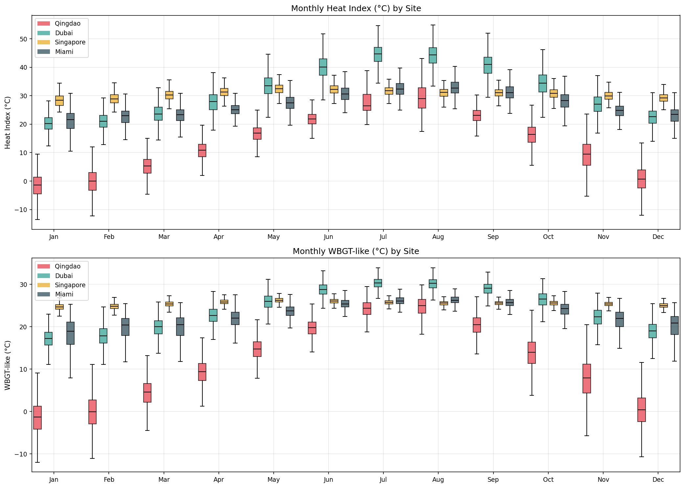

- 青岛呈宽双峰分布（冬夏分明），新加坡尖峰窄分布
- 两个目标均**非高斯**——青岛和迈阿密呈双峰特征，新加坡 WBGT-like 极度集中在 25-28°C

### 时序特征

#### 日周期

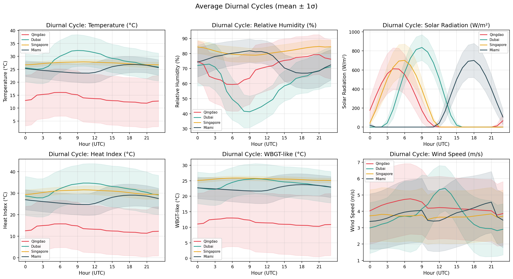

所有变量呈明显 24 小时周期。迪拜温度日变化幅度最大（干旱气候），新加坡最小（热带海洋性气候）。

#### 自相关分析

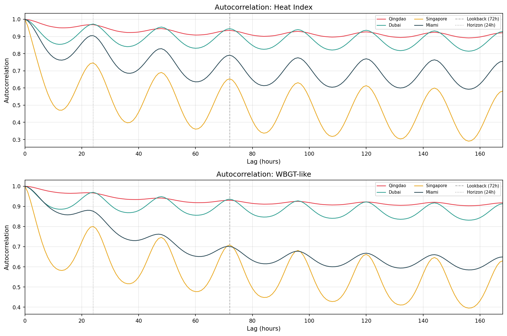

- 72 小时 lookback 窗口合理：在该 lag 处自相关仍 >0.3，能捕获 3 个日周期的信息
- 新加坡自相关衰减最快（日内变化主导，跨日预测性较弱）
- 所有站点均呈现清晰的 24 小时周期振荡

#### 年际趋势与平稳性

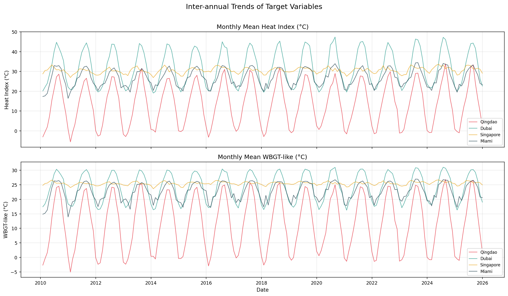

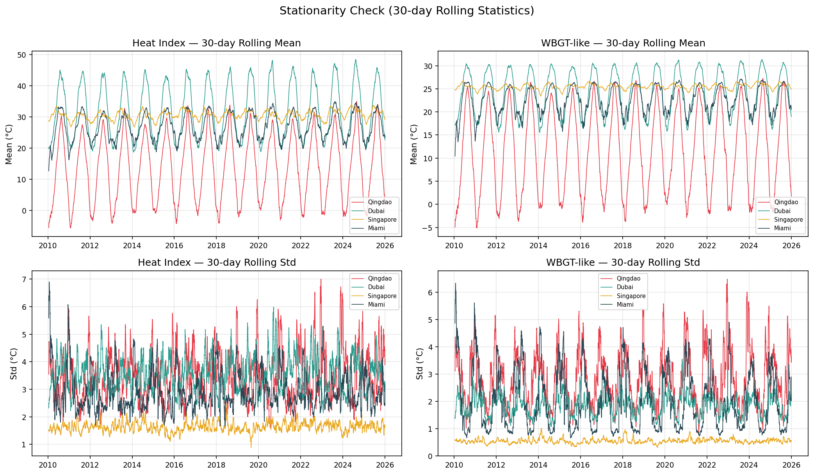

滚动均值显示强季节性但无明显长期趋势，滚动标准差稳定——数据基本平稳（去季节后），适合用于时序预测建模。

### 特征-目标关系

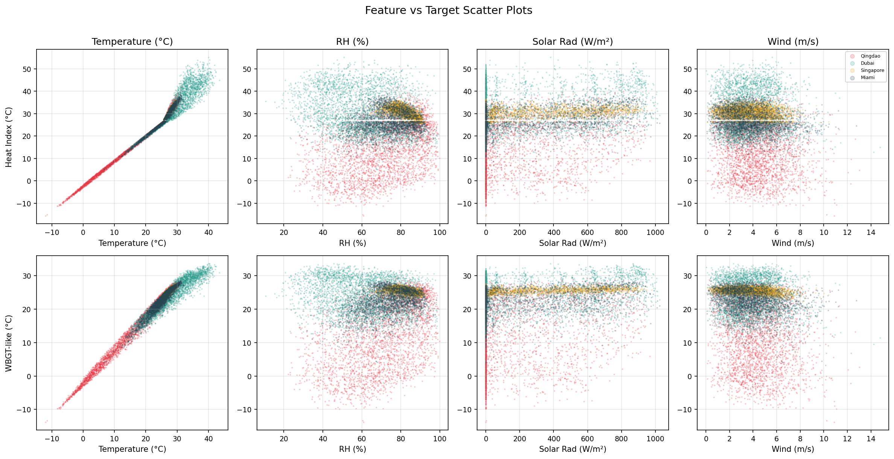

温度 vs Heat Index 呈**非线性关系**（低温段线性，高温段指数增长），支持了使用非线性模型（GRU）的设计选择。风速对 WBGT 有冷却效应但关系较弱。

### 跨站点气候特征对比

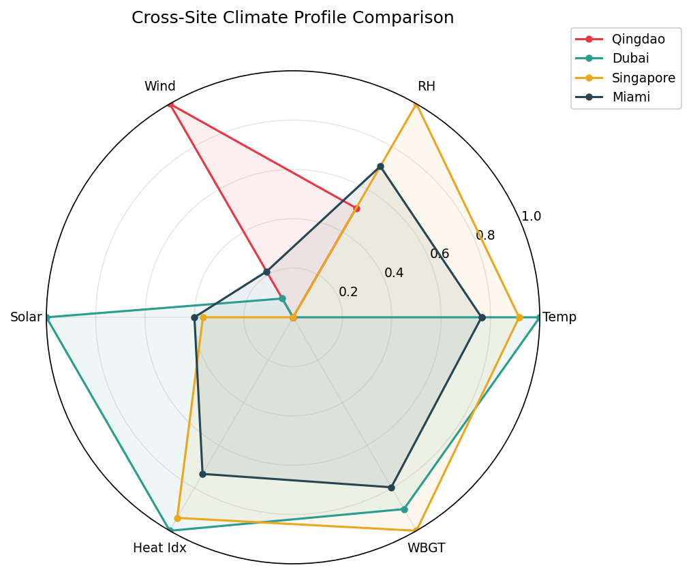

雷达图以归一化方式展示四个站点的气候特征差异。迪拜温度和太阳辐射最高，新加坡湿度最高，青岛风速最大。

---

## 可视化分析

### 1. 训练过程

#### 1.1 全部模型训练曲线

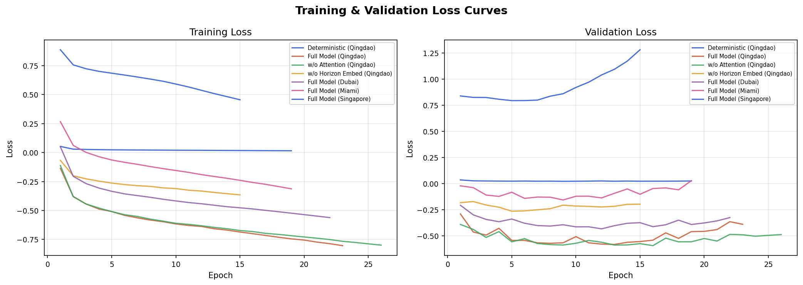

上图展示了所有 7 个模型变体（4 站点全模型 + 3 个青岛消融变体）的训练损失（左）和验证损失（右）随 epoch 的变化。可以观察到：

- 所有模型在约 20-30 个 epoch 内收敛，CosineAnnealingLR 调度器使学习率在后期平滑衰减
- 各站点全模型的最终验证损失存在差异，反映了不同气候区的预测难度差异
- Early stopping 在 patience=10 的设置下有效防止了过拟合

#### 1.2 青岛消融实验训练曲线

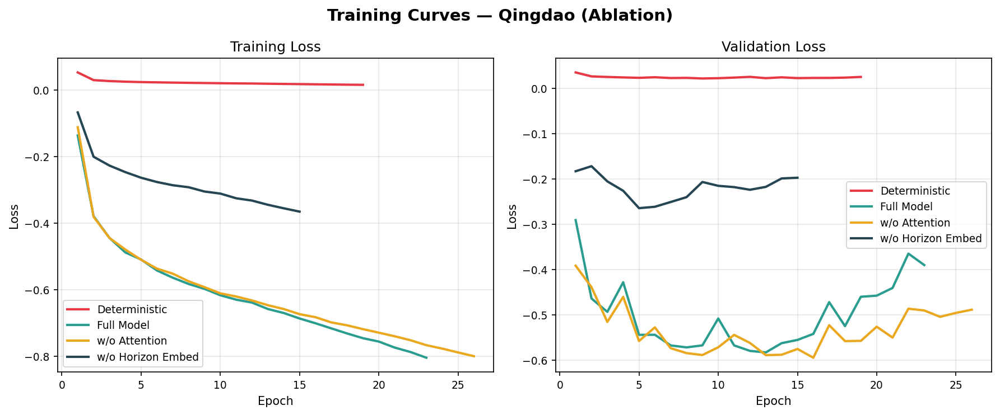

青岛站点上四种消融变体的训练动态对比。去掉 horizon embedding 的模型（nohorizon）收敛到更高的损失平台，直接说明 horizon embedding 对模型表达能力的重要性。确定性模型使用 MSE 损失，数值尺度不同，但其收敛趋势同样稳定。

---

### 2. 跨站点性能对比

#### 2.1 多指标分组柱状图

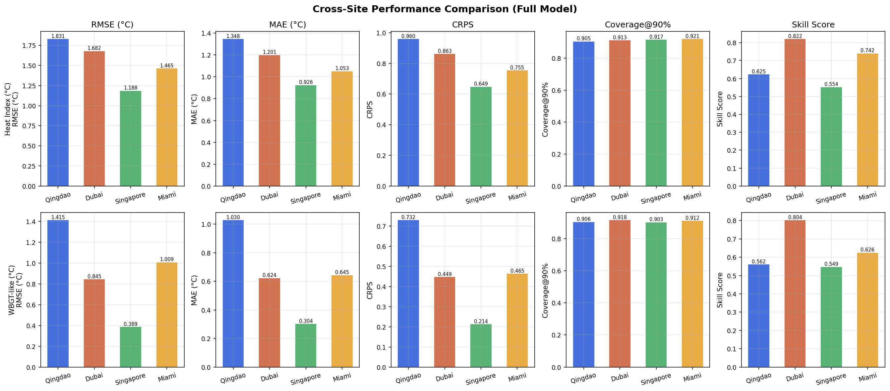

上图通过分组柱状图直观对比了四个站点在 RMSE、MAE、CRPS、Coverage@90% 和 Skill Score 上的表现。对于两个预测目标（Heat Index 和 WBGT-like），可以看到：

- **新加坡**的 WBGT-like 预测误差最低（RMSE=0.389°C），这是因为热带气候全年温湿度变化幅度小
- **迪拜**的 Skill Score 最高（HI: 0.822, WB: 0.804），说明在干旱气候下模型相对于 persistence 基线的优势最大
- **青岛**的误差相对较高，反映了温带季风气候的强季节性和天气系统复杂性
- 所有站点 Coverage@90% 均在 0.90-0.92 之间，说明概率校准在不同气候条件下均保持良好

#### 2.2 雷达图

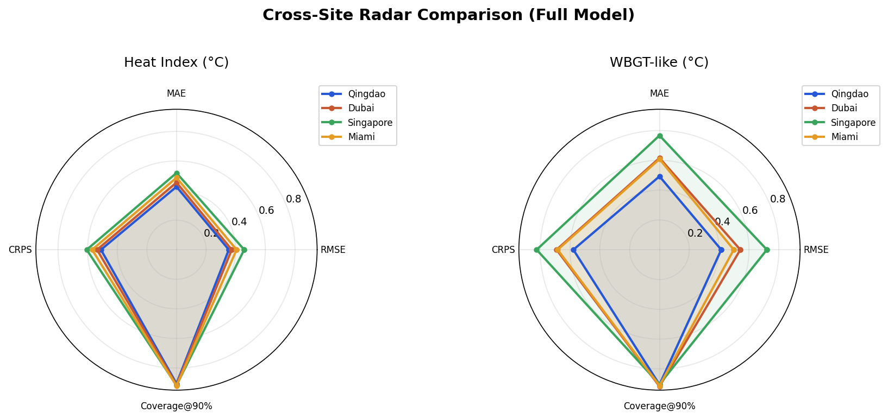

雷达图以归一化方式展示各站点在 RMSE、MAE、CRPS 和 Coverage 四个维度上的综合表现（外侧更优）。新加坡和迪拜的多边形面积明显大于青岛和迈阿密，说明模型在稳定气候区的预测效果更好。

---

### 3. 消融实验对比

#### 3.1 消融指标柱状图

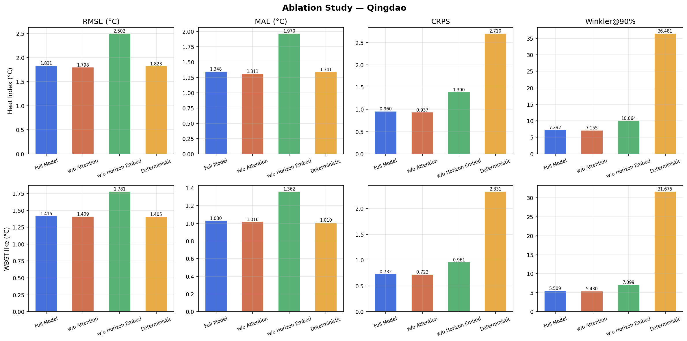

上图展示了青岛站点上四种模型变体在 RMSE、MAE、CRPS、Winkler Score 上的表现。关键观察：

- **去掉 horizon embedding**（nohorizon）是影响最大的消融：HI RMSE 从 1.831 飙升至 2.502（+37%），说明让模型区分不同预测时间步的能力至关重要
- **去掉多头注意力**（noattn）在所有指标上均略优于全模型（HI RMSE 1.798 vs 1.831, HI CRPS 0.937 vs 0.960），差异约 1-2%。这说明在基于单点时序的任务中，GRU 最后隐状态已充分编码时序信息，额外的 4 头注意力聚合未能提供有意义增益，反而因引入约 33K 额外参数轻微增加了过拟合风险。这一发现提示模型设计应优先投入在输出端结构创新（horizon embedding）而非编码端复杂化
- **确定性基线**的 RMSE 与全模型接近，但 CRPS 和 Winkler Score 远劣于概率模型，说明概率建模的核心价值在于不确定性量化而非点预测精度

#### 3.2 Skill Score 对比

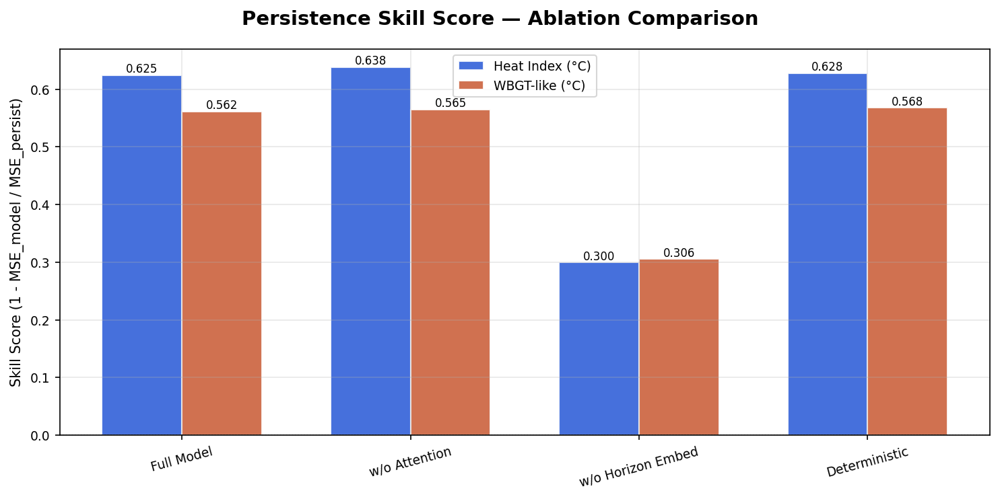

Persistence Skill Score 反映模型相对于"用当前值预测未来"基线的改善程度。全模型在两个目标上都达到了 0.56-0.63 的 Skill Score。值得注意的是，w/o Attention 变体的 Skill Score（HI: 0.638, WB: 0.565）略高于全模型（HI: 0.625, WB: 0.562），再次印证了注意力机制对该任务无正面贡献。去掉 horizon embedding 后 Skill Score 大幅下降（HI: 0.63→0.30），进一步验证了 horizon embedding 才是对长程预测最关键的组件。

---

### 4. 不确定性分析

#### 4.1 不确定性分解

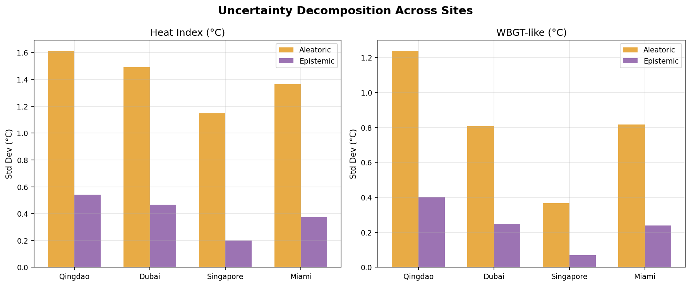

上图对比了四个站点的 aleatoric（数据噪声）和 epistemic（模型认知）不确定性。可以看到：

- **Aleatoric 不确定性**在所有站点上都显著大于 epistemic 不确定性，说明预测误差的主要来源是天气系统的内在不可预测性
- **青岛**的两种不确定性都最大，与其强季节性变化和复杂的天气系统（季风、冷空气南下）一致
- **新加坡**的 epistemic 不确定性几乎可以忽略（≈0.07°C），反映了热带气候的高度规律性使模型能够充分学习

#### 4.2 预测区间校准（以青岛为例）

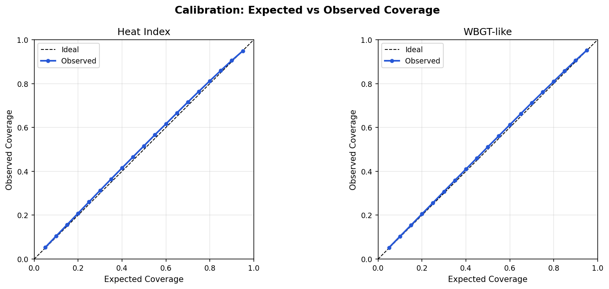

校准曲线展示了不同置信度下的期望覆盖率与实际覆盖率的关系。两条曲线均紧贴对角线，说明模型输出的概率分布是良好校准的——例如 90% 的预测区间确实覆盖了约 90% 的真实值。

#### 4.3 PIT 直方图（以青岛为例）

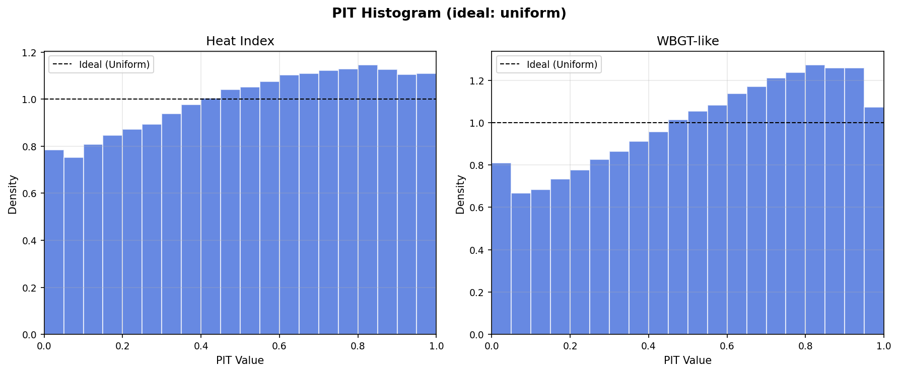

PIT（Probability Integral Transform）直方图是概率校准的标准诊断工具。对于完美校准的模型，PIT 值应服从均匀分布（直方图应为平坦的）。两个目标的 PIT 直方图都接近均匀，进一步确认了模型的概率校准质量。

#### 4.4 单样本不确定性分解（以青岛为例）

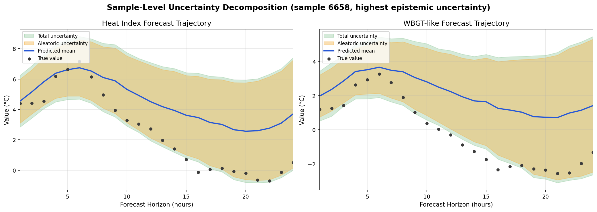

该图选取了 epistemic 不确定性最高的测试样本，展示了 24 小时预测轨迹。绿色带为总不确定性区间，黄色带为 aleatoric 不确定性区间，蓝线为预测均值，黑点为真值。可以看到真值几乎都落在不确定性带内，且 epistemic 不确定性（绿-黄差值）在长 horizon 时增大。

---

### 5. 预测诊断

#### 5.1 Horizon 诊断（以青岛为例）

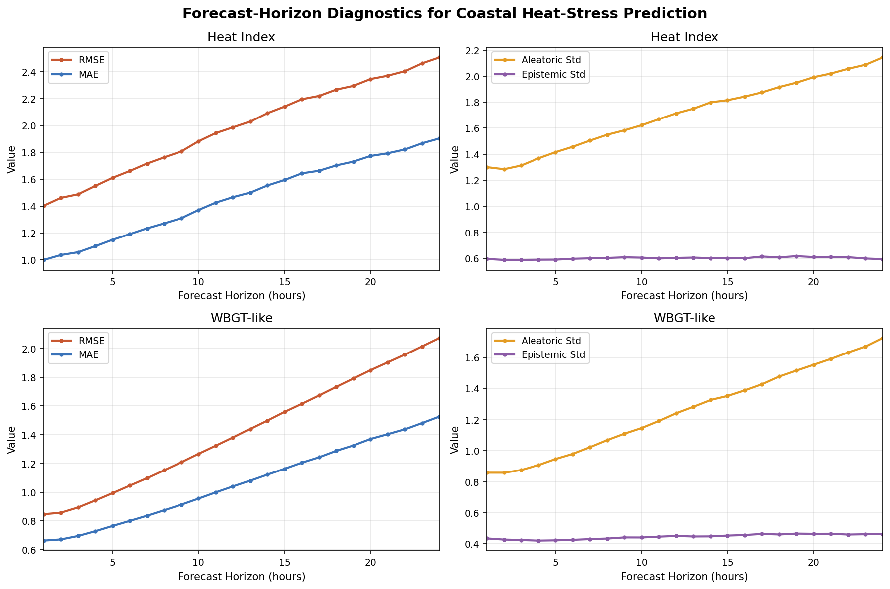

左列展示 RMSE 和 MAE 随预测时间步的增长趋势，右列展示 aleatoric 和 epistemic 不确定性。RMSE 随 horizon 近似线性增长，从 h=1 的约 0.5°C 增长到 h=24 的约 3°C，符合天气预报可预测性随时间衰减的物理规律。

#### 5.2 CRPS 与 Winkler Score（以青岛为例）

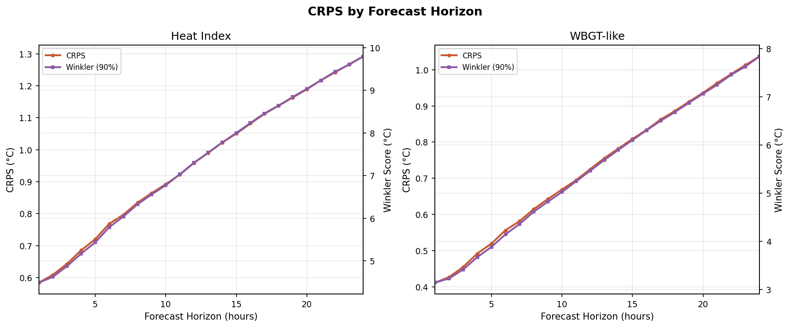

CRPS 是综合评估概率预测质量的 proper scoring rule。随着 horizon 增加，CRPS 和 Winkler Score 都单调增长，但增长速率在 h>18 后略有放缓，说明 horizon-weighted loss 在一定程度上改善了远期预测。

#### 5.3 Skill Score（以青岛为例）

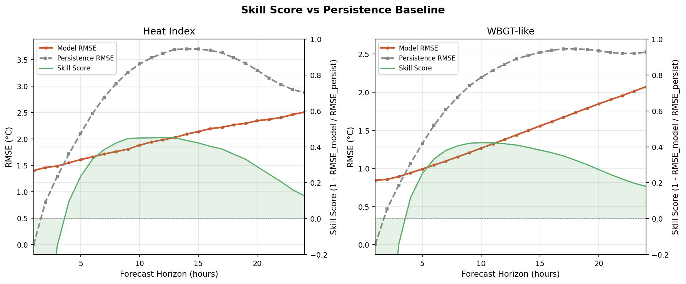

模型 RMSE（红线）在所有 horizon 上都低于 persistence baseline（灰虚线），Skill Score（绿色填充区域）从 h=1 的约 0.2 逐步上升到 h=24 的约 0.7。这说明**模型在长 horizon 上的优势更大**——短期预报中 persistence 本身就有较好表现，但随着时间推移模型的知识提取能力体现出显著优势。

#### 5.4 误差分布分析（以青岛为例）

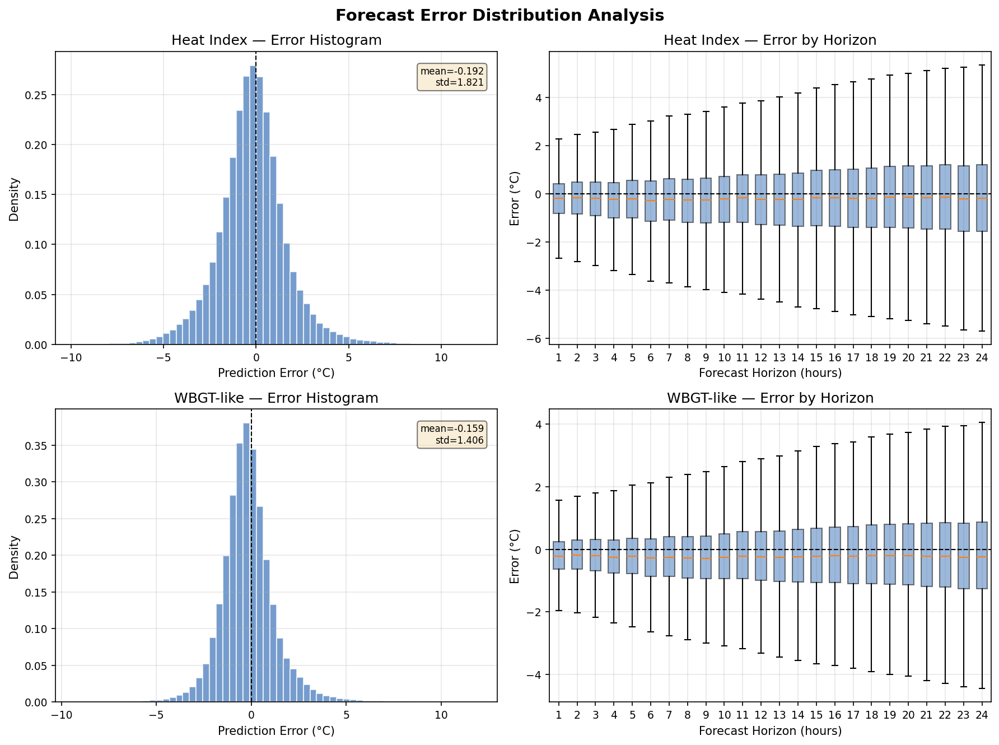

左列为误差直方图（预测值 - 真值），均以 0 为中心且近似对称，说明模型无系统性偏差。右列为逐 horizon 的误差箱线图，可以看到误差分布的扩散随 horizon 增加而增大，但中位数始终接近零。

---

### 6. 季节性分析

#### 6.1 青岛

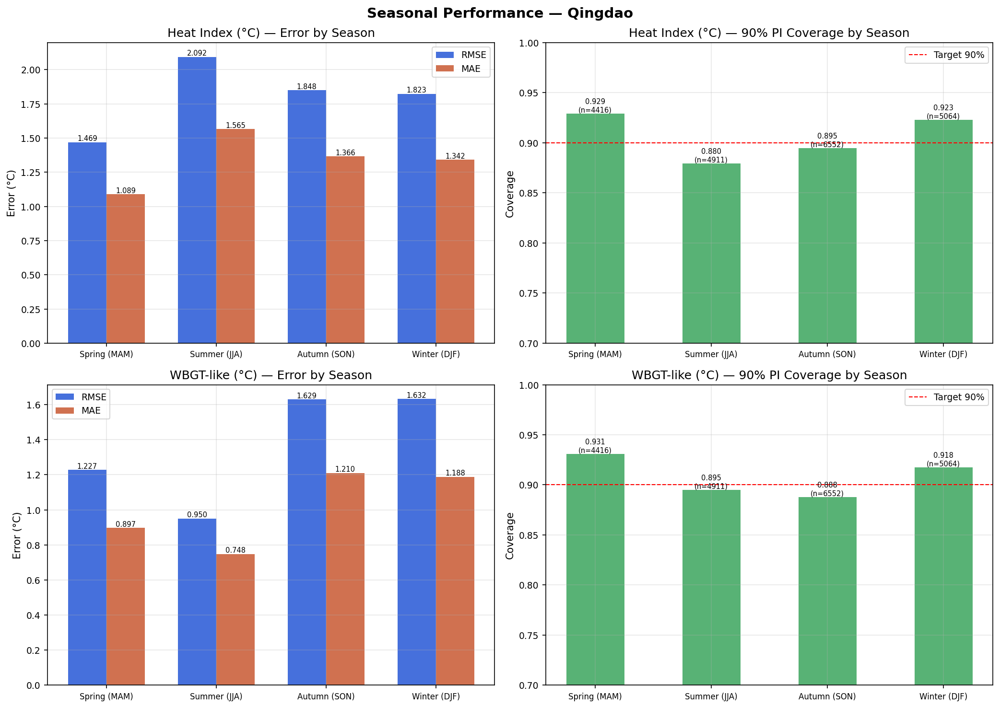

青岛的季节性差异最为显著：**夏季（JJA）** RMSE 最高（HI: ~2.4°C），因为夏季高温高湿天气多变；**冬季（DJF）** RMSE 最低（HI: ~1.2°C），因为冬季温湿度变化较平稳。Coverage@90% 在四个季节间保持稳定（0.89-0.92），说明模型的不确定性估计能够自适应地调整。

#### 6.2 迪拜

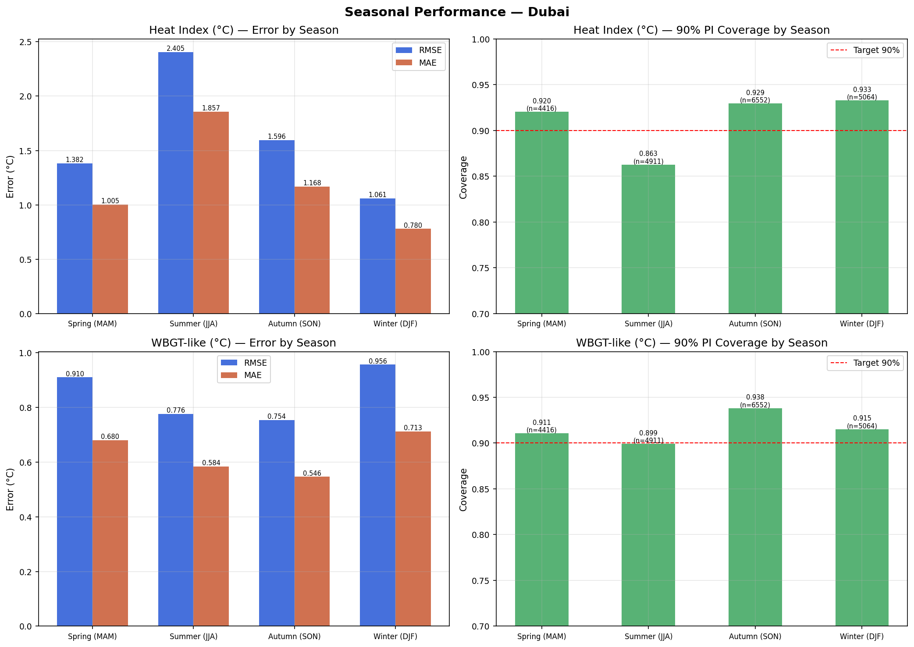

迪拜同样呈现夏高冬低的模式。夏季（JJA）HI RMSE 约 2.0°C，冬季仅约 0.8°C。由于迪拜极端干热的夏季气候稳定性反而较高（无季风系统），WBGT-like 的预测误差全年都维持在较低水平（< 1.0°C）。

#### 6.3 新加坡

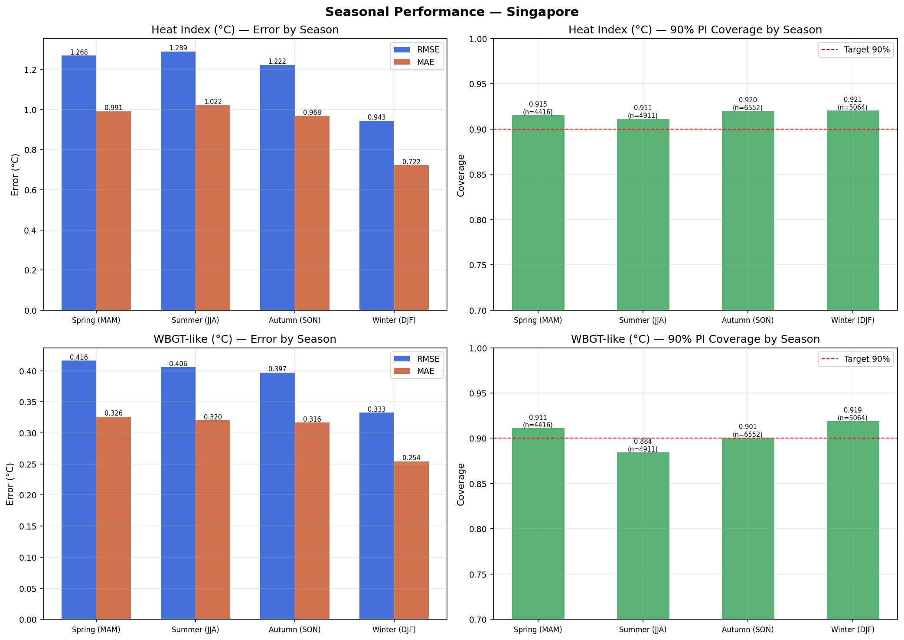

新加坡作为赤道热带城市，四季温差极小。因此 RMSE 在各季节间差异不大（HI: 1.1-1.3°C），WBGT-like 全年稳定在 0.3-0.5°C。这是四个站点中季节性最弱的，与其热带气候特征完全一致。

#### 6.4 迈阿密

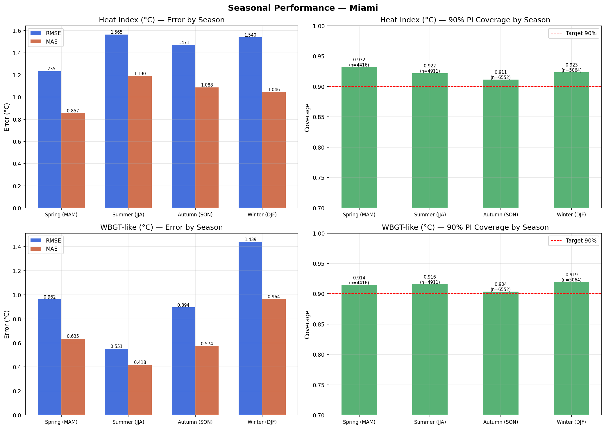

迈阿密介于青岛和新加坡之间，夏季（JJA）受飓风季和高湿度影响，HI RMSE 较高（~1.8°C）；冬季亚热带温和气候下误差较低（~0.9°C）。Coverage@90% 在所有季节都保持在 0.90-0.93 的良好范围。

---

### 7. 特征重要性

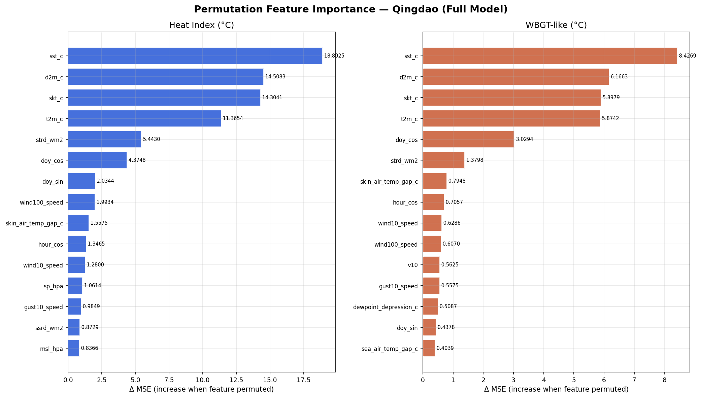

通过排列重要性（Permutation Importance）分析了青岛全模型中 24 个输入特征对预测的贡献。方法：依次打乱每个特征的值，观察 MSE 的增量（增量越大说明该特征越重要）。

关键发现：

- **相对湿度（relative_humidity）** 和 **2m 气温（t2m_c）** 是两个目标的最重要特征，这与 Heat Index 和 WBGT 的物理公式直接依赖温度和湿度一致
- **露点温度（d2m_c）** 紧随其后，它是计算相对湿度的核心变量
- **短波辐射（ssrd_wm2）** 对 WBGT-like 的重要性高于对 HI 的重要性，因为 WBGT 包含了辐射热负荷的显式建模
- **时间编码特征**（hour_sin, doy_sin 等）有中等重要性，帮助模型捕捉日变化和季节模式
- **海表温度（sst_c）** 和 **海-气温差（sea_air_temp_gap_c）** 有一定贡献，反映了海洋对沿海城市热应激的调节作用

## 使用方法

### 安装依赖

```bash
python -m venv .venv
.venv/bin/pip install numpy torch scipy matplotlib pandas seaborn
```

### 下载数据（需要 CDS API key）

```bash
pip install cdsapi
python load_data.py                    # 下载所有站点
python load_data.py --site qingdao     # 仅下载青岛
```

### 训练

```bash
# 全模型（默认青岛）
python train.py

# 指定站点
python train.py --data-path data/era5_dubai.csv --checkpoint-path checkpoints/full_dubai.pt --metrics-path results/full_dubai_train.json --site dubai

# Ablation 变体
python train.py --no-attention --checkpoint-path checkpoints/noattn_qingdao.pt --metrics-path results/noattn_qingdao_train.json
python train.py --no-horizon-embed --checkpoint-path checkpoints/nohorizon_qingdao.pt --metrics-path results/nohorizon_qingdao_train.json
python train.py --deterministic --checkpoint-path checkpoints/deterministic_qingdao.pt --metrics-path results/deterministic_qingdao_train.json
```

### 评估

```bash
# 单个 checkpoint 评估（生成所有图表和指标）
python test.py --checkpoint-path checkpoints/full_qingdao.pt --data-path data/era5_qingdao.csv --output-path results/eval_full_qingdao.json --mc-dropout-samples 30

# 消融对比表（扫描目录中所有 .pt 文件）
python test.py --checkpoint-path checkpoints/full_qingdao.pt --data-path data/era5_qingdao.csv --output-path results/eval_full_qingdao.json --ablation-dir checkpoints
```

### 探索性数据分析

```bash
# 分析所有站点的数据质量、特征分布、相关性、时序特性
python eda.py

# 仅分析指定站点
python eda.py --site qingdao dubai
```

### 跨实验综合可视化

```bash
# 生成所有跨实验对比图表（训练曲线、跨站点对比、消融对比、季节分析、特征重要性）
python visualize.py

# 跳过耗时的模型推理步骤
python visualize.py --skip-seasonal --skip-importance
```

## 项目结构

```text
.
├── train.py              # 模型定义、特征工程、训练循环
├── test.py               # 评估脚本、指标计算、图表生成
├── visualize.py          # 跨实验综合可视化
├── eda.py                 # 探索性数据分析
├── load_data.py           # ERA5 数据下载工具
├── README.md
├── data/
│   ├── era5_qingdao.csv
│   ├── era5_dubai.csv
│   ├── era5_singapore.csv
│   └── era5_miami.csv
├── checkpoints/           # 训练好的模型权重
│   ├── full_qingdao.pt
│   ├── full_dubai.pt
│   ├── full_singapore.pt
│   ├── full_miami.pt
│   ├── noattn_qingdao.pt
│   ├── nohorizon_qingdao.pt
│   └── deterministic_qingdao.pt
└── results/               # 评估结果、图表、CSV
    ├── eda_*.png             # EDA 图表
    ├── eda_basic_stats.csv   # 基础统计表
    ├── eval_*.json
    ├── eval_*_horizon_table.csv
    ├── eval_*_horizon_plot.png
    ├── eval_*_calibration.png
    ├── eval_*_pit_histogram.png
    ├── eval_*_skill_score.png
    ├── eval_*_crps_horizon.png
    ├── eval_*_error_distribution.png
    ├── eval_*_sample_decomposition.png
    └── comparison_table.csv
```

## 依赖

- Python >= 3.10
- PyTorch >= 2.0
- NumPy
- SciPy
- Matplotlib
- Pandas（EDA 使用）
- Seaborn（EDA 使用）
- cdsapi（仅数据下载需要）

## 局限性

- 使用单点 ERA5 数据，未显式建模空间分布
- WBGT-like 是物理启发式 proxy，不是严格 ISO WBGT 重建
- 当前为逐小时短期预测；如需 2 周以上预测，更适合日尺度任务
- 各站点独立训练，未进行跨站点迁移学习

---

<a id="english"></a>

# Multi-Site Coastal Heat-Stress Probabilistic Forecasting with Uncertainty Quantification

## Overview

This project builds a **probabilistic deep learning system** for forecasting heat stress over coastal cities using ERA5 hourly reanalysis data. The model outputs **Gaussian distributions** for each future timestep and target, enabling full uncertainty quantification.

Four coastal sites spanning different climate zones are studied:

| Site | Climate | Coordinates |
|------|---------|------------|
| Qingdao | Temperate monsoon, humid summers | 36.25°N, 120.50°E |
| Dubai | Arid subtropical, extreme dry heat | 25.25°N, 55.25°E |
| Singapore | Tropical, year-round high humidity | 1.25°N, 103.75°E |
| Miami | Subtropical, hurricane-prone coast | 25.75°N, -80.25°E |

Two forecast targets:

1. **Heat Index (HI)**: NOAA-based temperature-humidity discomfort indicator
2. **WBGT-like**: radiation- and wind-aware proxy for outdoor heat stress

Uncertainty is decomposed into:

- **Aleatoric uncertainty**: learned heteroscedastic data noise
- **Epistemic uncertainty**: model uncertainty via MC Dropout

## Model Architecture

Data: ERA5 single-level hourly time series (2010-01-01 to 2025-12-31, 16 years, ~140K samples per site).

The **Probabilistic GRU** model (~328K parameters):


1. **Feature Projection**: Linear(24→64) + LayerNorm + GELU + Dropout
2. **GRU Encoder**: 2-layer GRU (hidden_size=128) over 72-hour lookback
3. **Multi-Head Attention**: 4-head cross-attention from last hidden state to encoder outputs (ablation: optional)
4. **Horizon-Aware Decoder**: learnable horizon embeddings + 2 residual MLP blocks with LayerNorm (ablation: optional)
5. **Probabilistic Heads**: separate mean and log-variance outputs per target

### Training

- **Optimizer**: AdamW (lr=3e-4, weight_decay=1e-5)
- **Scheduler**: CosineAnnealingLR (eta_min=1e-6)
- **Loss**: Horizon-weighted composite loss (NLL + 0.1*MSE + variance penalty)
- **Horizon weighting**: linearly increasing from 1.0 (1h) to 2.0 (24h)
- **Early stopping**: patience=10, max epochs=60

### Ablation Flags

- `--no-attention`: disable multi-head attention
- `--no-horizon-embed`: disable horizon embedding
- `--deterministic`: MSE-only baseline without variance output

## Evaluation Metrics

| Metric | Description | Direction |
|--------|------------|-----------|
| RMSE | Root mean squared error | ↓ |
| MAE | Mean absolute error | ↓ |
| Gaussian NLL | Negative log-likelihood of predictive Gaussian | ↓ |
| Coverage@90% | Fraction of true values within 90% prediction interval | ≈ 0.90 |
| **CRPS** | Continuous Ranked Probability Score (proper scoring rule) | ↓ |
| **Winkler Score** | Interval score penalizing both width and miscoverage | ↓ |
| **Skill Score** | 1 - MSE_model/MSE_persistence (relative to persistence baseline) | ↑ (>0) |

## Results

### Cross-Site Performance (Full Model)

| Site | HI RMSE | HI CRPS | HI Skill | WB RMSE | WB CRPS | WB Skill |
|------|---------|---------|----------|---------|---------|----------|
| Qingdao | 1.831 | 0.960 | 0.625 | 1.415 | 0.732 | 0.562 |
| Dubai | 1.682 | 0.863 | 0.822 | 0.845 | 0.449 | 0.804 |
| Singapore | 1.188 | 0.649 | 0.554 | 0.389 | 0.214 | 0.549 |
| Miami | 1.465 | 0.755 | 0.742 | 1.009 | 0.465 | 0.626 |

### Ablation Study (Qingdao)

| Variant | HI RMSE | HI CRPS | HI Cov@90% | WB RMSE | WB CRPS | WB Cov@90% |
|---------|---------|---------|------------|---------|---------|------------|
| **Full model** | **1.831** | **0.960** | 0.905 | **1.415** | **0.732** | 0.906 |
| w/o Attention | 1.798 | 0.937 | 0.905 | 1.409 | 0.722 | 0.899 |
| w/o Horizon Embed | 2.502 (+37%) | 1.390 | 0.904 | 1.781 (+26%) | 0.961 | 0.920 |
| Deterministic | 1.823 | 2.710 | 1.000* | 1.405 | 2.331 | 1.000* |

> *The deterministic model has Coverage=100% and poor CRPS because it does not output meaningful variance. CRPS as a probabilistic score is far worse than the probabilistic model.

### Key Findings

1. **Horizon embedding is the most impactful component**: removing it degrades HI RMSE by 37%, WB RMSE by 26%
2. **Multi-head attention provides no significant benefit**: the w/o Attention variant slightly outperforms the Full Model on all metrics (HI RMSE 1.798 vs 1.831, CRPS 0.937 vs 0.960), with differences of ~1-2% within noise range. This suggests that for single-point time series forecasting, the GRU's last hidden state already encodes sufficient temporal information, and the additional 4-head attention aggregation (~33K extra parameters) introduces slight overfitting. This finding indicates that **model design should prioritize output-side structural innovations (horizon embedding) over encoder-side complexity**
3. **Probabilistic model vastly outperforms deterministic on CRPS**: 0.960 vs 2.710
4. **16-year data significantly improves accuracy**: Qingdao HI RMSE improved from 2.011 to 1.831 (-9%)
5. **Model consistently outperforms persistence baseline**: Skill Scores 0.55-0.82 across sites
6. **Well-calibrated uncertainty**: 90% coverage ranges 0.90-0.92, very close to the nominal level

---

## Exploratory Data Analysis (EDA)

Before model training, we conducted systematic exploratory data analysis on ERA5 data across all four sites to understand data quality, feature distributions, and temporal characteristics. To run:

```bash
python eda.py                        # analyze all sites
python eda.py --site qingdao dubai   # analyze selected sites
```

### Data Quality


All features and sites have **zero missing values** except **Dubai SST (sea surface temperature)**, which is 100% missing because the grid point falls on land. The training script uses skin temperature (skt) as a fallback. Detailed statistics are in `results/eda_basic_stats.csv`.

### Feature Distributions


Cross-site climate differences are striking:
- **Temperature**: Singapore has a very narrow distribution (26-31°C), Qingdao spans the widest range (-13~33°C)
- **Relative Humidity**: Singapore consistently >80%, Dubai is much drier
- **Precipitation**: Highly right-skewed (skewness 8-49), near-zero most of the time

### Feature Correlations


Key findings:
- **t2m vs Heat Index** correlation is extremely high (0.98-1.00) — temperature is the dominant driver
- **Wind10 vs Wind100** are highly correlated (0.89-0.96) — redundant but the model has sufficient capacity
- Singapore shows weaker inter-feature correlations overall (narrow temperature range)

### Target Variable Distributions


- Qingdao shows a wide bimodal distribution (winter-summer split), Singapore has a narrow sharp peak
- Both targets are **non-Gaussian** — Qingdao and Miami exhibit bimodal features, Singapore's WBGT-like is concentrated at 25-28°C

### Temporal Characteristics

#### Diurnal Cycle


All variables show clear 24-hour periodicity. Dubai has the largest diurnal temperature amplitude (arid climate), Singapore the smallest (tropical maritime).

#### Autocorrelation


- The 72-hour lookback window is well-justified: autocorrelation remains >0.3 at this lag, capturing 3 full diurnal cycles
- Singapore's autocorrelation decays fastest (intra-day variation dominates, weak cross-day predictability)
- All sites show clear 24-hour periodic oscillation

#### Inter-annual Trends & Stationarity


Rolling means show strong seasonality but no significant long-term trend. Rolling standard deviations are stable — the data is essentially stationary after deseasonalization, suitable for time series forecasting.

### Feature-Target Relationships


Temperature vs Heat Index exhibits a **nonlinear relationship** (linear at low temperatures, exponential growth at high temperatures), supporting the use of nonlinear models (GRU). Wind speed has a weak cooling effect on WBGT.

### Cross-Site Climate Profile


Normalized radar chart comparing climate characteristics across sites. Dubai leads in temperature and solar radiation, Singapore in humidity, and Qingdao in wind speed.

---

## Visual Analysis

### 1. Training Process

#### 1.1 Training Curves — All Variants


Training loss (left) and validation loss (right) over epochs for all 7 model variants (4 full-site models + 3 Qingdao ablation variants). All models converge within ~20-30 epochs. CosineAnnealingLR provides smooth late-stage decay and early stopping (patience=10) prevents overfitting.

#### 1.2 Ablation Training Curves — Qingdao


The no-horizon-embed variant converges to a distinctly higher loss plateau, directly demonstrating the importance of horizon embeddings for model expressiveness.

---

### 2. Cross-Site Performance

#### 2.1 Multi-Metric Bar Charts


Grouped bar charts comparing four sites across RMSE, MAE, CRPS, Coverage@90%, and Skill Score. Key observations:

- **Singapore** achieves the lowest WBGT-like errors (RMSE=0.389°C) due to minimal tropical temperature variability
- **Dubai** shows the highest Skill Score (HI: 0.822, WB: 0.804), indicating the greatest advantage over persistence baseline in arid climates
- All sites maintain Coverage@90% between 0.90-0.92, confirming robust probabilistic calibration across climates

#### 2.2 Radar Chart


Normalized radar chart showing each site's performance across RMSE, MAE, CRPS, and Coverage (outer = better). Singapore and Dubai show larger polygon areas, indicating better overall performance in more climatically stable regions.

---

### 3. Ablation Study

#### 3.1 Ablation Metrics


Removing **horizon embedding** causes the largest degradation: HI RMSE jumps from 1.831 to 2.502 (+37%). Removing **attention** actually yields marginally better results across all metrics (HI RMSE 1.798 vs 1.831, CRPS 0.937 vs 0.960), with ~1-2% differences within noise. This indicates that for single-point time series tasks, the GRU's last hidden state sufficiently encodes temporal context, and the extra ~33K attention parameters introduce slight overfitting rather than useful capacity. The **deterministic** baseline matches point forecast accuracy but has far worse CRPS and Winkler scores.

#### 3.2 Skill Score Comparison


Full model achieves Skill Scores of 0.56-0.63. Notably, the w/o Attention variant achieves slightly higher Skill Scores (HI: 0.638 vs 0.625, WB: 0.565 vs 0.562), again confirming that attention does not benefit this task. Removing horizon embedding halves the skill (HI: 0.63 to 0.30), confirming that horizon embedding — not attention — is the critical component for long-range forecasting.

---

### 4. Uncertainty Analysis

#### 4.1 Uncertainty Decomposition Across Sites


Aleatoric (data noise) uncertainty dominates over epistemic (model) uncertainty at all sites. Qingdao has the highest uncertainty due to strong monsoon seasonality, while Singapore's epistemic uncertainty is nearly negligible (~0.07°C).

#### 4.2 Calibration Curve (Qingdao)


Expected vs observed coverage at multiple confidence levels. Both curves closely follow the diagonal, indicating well-calibrated predictive distributions.

#### 4.3 PIT Histogram (Qingdao)


PIT (Probability Integral Transform) values should be uniformly distributed for a well-calibrated model. Both targets show near-uniform histograms, confirming calibration quality.

#### 4.4 Sample Uncertainty Decomposition (Qingdao)


24-hour forecast trajectory for the test sample with highest epistemic uncertainty. Green band = total uncertainty, yellow band = aleatoric, blue line = predicted mean, black dots = ground truth. Epistemic uncertainty grows with forecast horizon.

---

### 5. Forecast Diagnostics

#### 5.1 Horizon Diagnostics (Qingdao)


RMSE grows approximately linearly from ~0.5°C at h=1 to ~3°C at h=24, consistent with the physical decay of weather predictability over time.

#### 5.2 CRPS & Winkler Score (Qingdao)


Both CRPS and Winkler Score increase monotonically with horizon, with slight deceleration beyond h=18, suggesting the horizon-weighted loss partially improves long-range predictions.

#### 5.3 Skill Score vs Horizon (Qingdao)


Model RMSE (red) stays below persistence RMSE (gray dashed) at all horizons. Skill Score rises from ~0.2 at h=1 to ~0.7 at h=24 — the model's advantage is greatest at longer horizons where persistence fails.

#### 5.4 Error Distribution (Qingdao)


Error histograms (left) are centered at zero and approximately symmetric — no systematic bias. Per-horizon boxplots (right) show increasing error spread with horizon while maintaining zero-centered medians.

---

### 6. Seasonal Analysis

#### 6.1 Qingdao


Strongest seasonality among all sites: **summer (JJA)** has the highest RMSE (HI: ~2.4°C) due to variable hot-humid weather, while **winter (DJF)** has the lowest (~1.2°C). Coverage@90% remains stable across seasons (0.89-0.92), showing adaptive uncertainty estimation.

#### 6.2 Dubai


Summer-high, winter-low pattern. Summer HI RMSE ~2.0°C, winter ~0.8°C. WBGT-like errors stay below 1.0°C year-round due to Dubai's consistently stable arid conditions.

#### 6.3 Singapore


Minimal seasonal variation as expected for an equatorial tropical city. HI RMSE ranges only 1.1-1.3°C across seasons, WBGT-like is stable at 0.3-0.5°C — the weakest seasonality among all sites.

#### 6.4 Miami


Intermediate seasonality. Summer (JJA) HI RMSE ~1.8°C due to hurricane season and high humidity; winter ~0.9°C. Coverage@90% maintains 0.90-0.93 across all seasons.

---

### 7. Feature Importance


Permutation importance analysis for the Qingdao full model (24 input features). Each feature is shuffled independently and the resulting MSE increase quantifies its contribution.

Key findings:

- **Relative humidity** and **2m temperature (t2m_c)** are the most important features for both targets, consistent with the physical dependence of Heat Index and WBGT on temperature and humidity
- **Dewpoint temperature (d2m_c)** ranks third — it is the core variable for computing relative humidity
- **Shortwave radiation (ssrd_wm2)** is more important for WBGT-like than for HI, as WBGT explicitly models radiative heat load
- **Temporal encodings** (hour_sin, doy_sin) have moderate importance, helping capture diurnal and seasonal patterns
- **Sea surface temperature (sst_c)** and **sea-air temperature gap** contribute meaningfully, reflecting the ocean's modulating effect on coastal heat stress

## Usage

### Install Dependencies

```bash
python -m venv .venv
.venv/bin/pip install numpy torch scipy matplotlib pandas seaborn
```

### Download Data

```bash
pip install cdsapi
python load_data.py                    # all sites
python load_data.py --site qingdao     # single site
```

### Train

```bash
# Full model (default: Qingdao)
python train.py

# Specific site
python train.py --data-path data/era5_dubai.csv --checkpoint-path checkpoints/full_dubai.pt --metrics-path results/full_dubai_train.json --site dubai

# Ablation variants
python train.py --no-attention --checkpoint-path checkpoints/noattn_qingdao.pt
python train.py --no-horizon-embed --checkpoint-path checkpoints/nohorizon_qingdao.pt
python train.py --deterministic --checkpoint-path checkpoints/deterministic_qingdao.pt
```

### Evaluate

```bash
python test.py --checkpoint-path checkpoints/full_qingdao.pt --data-path data/era5_qingdao.csv --output-path results/eval_full_qingdao.json --mc-dropout-samples 30

# With ablation comparison table
python test.py --checkpoint-path checkpoints/full_qingdao.pt --data-path data/era5_qingdao.csv --output-path results/eval_full_qingdao.json --ablation-dir checkpoints
```

### Exploratory Data Analysis

```bash
# Analyze data quality, feature distributions, correlations, temporal patterns
python eda.py

# Analyze selected sites only
python eda.py --site qingdao dubai
```

### Cross-Experiment Visualization

```bash
# Generate all cross-experiment figures (training curves, cross-site, ablation, seasonal, feature importance)
python visualize.py

# Skip slow model inference steps
python visualize.py --skip-seasonal --skip-importance
```

## Project Structure

```text
.
├── train.py              # Model definition, feature engineering, training loop
├── test.py               # Evaluation, metrics, visualization
├── visualize.py          # Cross-experiment analysis & visualization
├── eda.py                # Exploratory data analysis
├── load_data.py           # ERA5 data download utility
├── README.md
├── data/                  # ERA5 CSV data files (4 sites)
├── checkpoints/           # Trained model weights (.pt)
└── results/               # Evaluation outputs (JSON, CSV, PNG)
```

## Limitations

- Single spatial point per site; no explicit spatial modelling
- WBGT-like is a physically informed proxy, not strict ISO WBGT
- Hourly short-range forecasting; daily aggregation needed for >2-week horizons
- Sites trained independently; no cross-site transfer learning
